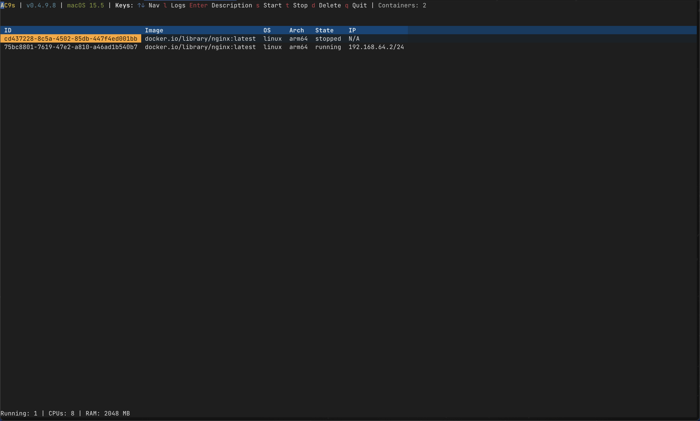
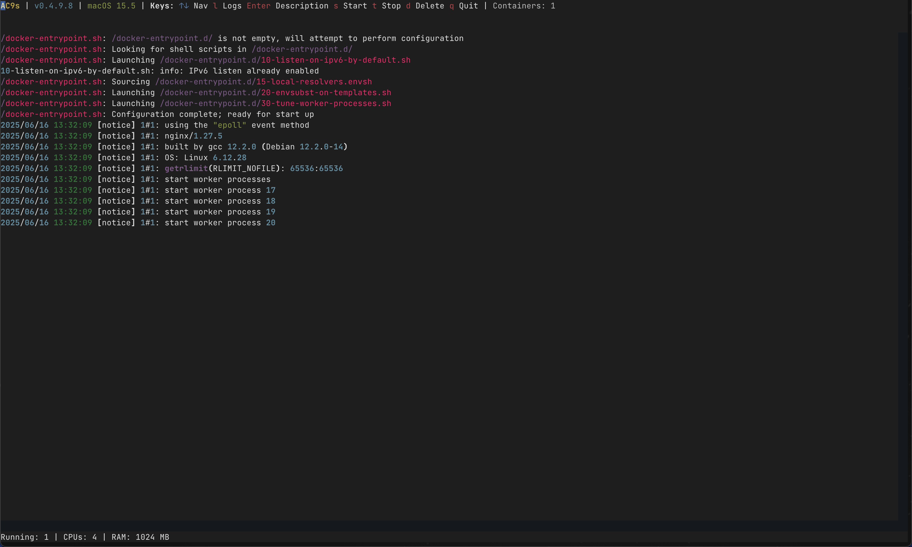
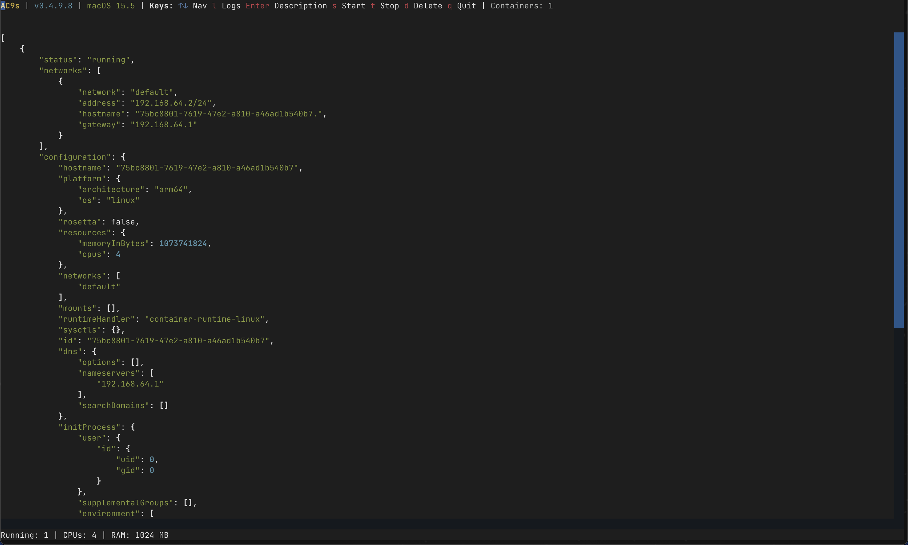

# AC9s — Apple Container TUI

AC9s is a Textual-powered TUI (Terminal User Interface) tool for managing Apple containers running on macOS 15+ (Apple's native container runtime).

It provides a live dashboard for:

- Listing containers
- Inspecting container metadata
- Viewing container logs
- Starting, stopping, and deleting containers

AC9s is heavily inspired by [K9s](https://k9scli.io/) which is a TUI used for managing Kubernetes Clusters

---

## Features

- Live container list view (auto-refreshing)
- Container details via `container inspect`
- Logs view for any running container
- Displays CPU and RAM allocations per container
- Keyboard-based full control interface
- Built with `textual`

---

## Prerequisites

- macOS 15+ (Sonoma or Sequoia beta with native container support)
- Apple's `container` CLI installed (part of macOS 15 Developer Preview)
- Python 3.10+
- Docker images available to the container runtime

---

## Installation

### Clone the repo
```
git clone https://github.com/cafiore7/ac9s.git
cd ac9s
```
### Create virtual environment
```
python3 -m venv venv
source venv/bin/activate
```
### Install dependencies
```
pip install -r requirements.txt
```
Or, optionally, install as a proper package:
```
pip install .
```
This will install `ac9s` as a CLI command.

---

## Running the Tool

### Option 1 (dev mode)
```
make run
```
### Option 2 (installed CLI)
```
ac9s
```
---

## Key Bindings

| Key | Action            |
|-----|--------------------|
| ↑↓  | Navigate container list |
| `l` | View logs          |
| `Enter` | View container description |
| `s` | Start container    |
| `t` | Stop container     |
| `d` | Delete container   |
| `q` or `Esc` | Quit / return |

---

## Screenshots




---

## Roadmap (Planned Features)

- Log streaming (experimental branch)
- Help screen (`?`) listing keybindings
- Sort/filter containers
- Create new containers directly via UI
- Live CPU/memory resource usage

---

## Developer Notes

- This project uses Apple's new container runtime on macOS 15+ which exposes the `container` CLI.
- Built using Textual framework for terminal UI development.
- Architecture:

ac9s/
- app.py        # UI + logic
- model.py      # Data model for container info
- control.py    # Container lifecycle operations

---

## License

MIT License

